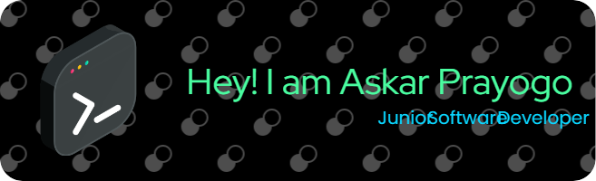

## Hi Welcome To My Github Profile 👋

- **🌱 Hi, I'm a passionate tech enthusiast and currently a university student deeply interested in the ever-evolving world of technology.**

- **🚀 I'm constantly learning and building projects that combine frontend and backend technologies. Currently, I'm diving into Android app development using React Native. Let's connect and create something impactful together!**

#### Skills

                

#### Connect With Me

 

